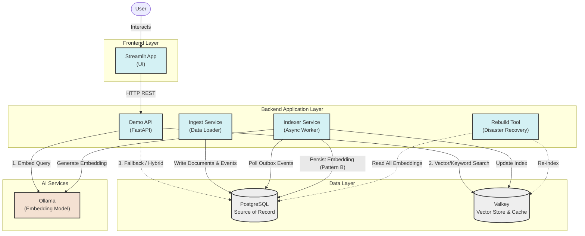

# RAG High-Perf System Architecture

본 문서는 `usecase_rag_highperf` 프로젝트의 전체 시스템 아키텍처와 데이터 흐름을 기술합니다.

## 1. High-Level Architecture

시스템은 크게 **Frontend**, **Backend Application**, **Data Layer**, **AI Services**로 구성됩니다.

## 2. 주요 컴포넌트 설명

### 2.1 Frontend Layer
*   **Streamlit App**: 사용자가 검색을 수행하고 결과를 시각적으로 확인하는 웹 인터페이스입니다. 검색 모드(Semantic, Keyword, Hybrid) 및 엔진(Valkey, PGVector)을 선택할 수 있습니다.

### 2.2 Backend Application Layer
*   **Demo API (FastAPI)**: UI의 요청을 처리하는 REST API 서버입니다. 검색 로직을 캡슐화하고 있으며, 상황에 따라 Valkey 또는 Postgres로 쿼리를 라우팅합니다.
*   **Ingest Service**: 원본 문서 데이터를 파싱하여 청크(Chunk)로 분할하고, Postgres에 저장하며 `outbox_events`를 발행합니다.
*   **Indexer Service**: 비동기 워커 프로세스입니다. Postgres의 `outbox_events`를 폴링하여 변경 사항을 감지하고, Ollama를 통해 임베딩을 생성한 후 Valkey와 Postgres에 색인 정보를 업데이트합니다.
*   **Rebuild Tool**: Valkey 데이터 유실 시, Postgres에 저장된 원본 데이터와 임베딩(`chunk_embeddings`)을 기반으로 Valkey 인덱스를 고속으로 복구합니다.

### 2.3 Data Layer
*   **PostgreSQL (Source of Record)**: 시스템의 모든 영구 데이터를 저장하는 원천 저장소입니다.
    *   `documents`, `chunks`: 원본 데이터
    *   `doc_acl`: 문서 접근 권한
    *   `outbox_events`: 데이터 변경 이벤트 (Transactional Outbox 패턴)
    *   `chunk_embeddings`: 벡터 임베딩 원본 (Pattern B, 복구 및 Fallback용)
*   **Valkey (Vector Store & Cache)**: 고성능 검색을 위한 인메모리 벡터 저장소입니다.
    *   `idx:chunks`: HNSW 벡터 인덱스 및 텍스트 인덱스

### 2.4 AI Services
*   **Ollama**: 로컬 LLM 실행 환경입니다. `nomic-embed-text` 모델을 사용하여 텍스트를 768차원 벡터로 변환합니다.

## 3. 주요 데이터 흐름 (Data Flows)

### 3.1 데이터 적재 및 색인 (Ingestion & Indexing)
1.  **Ingest**: 문서 -> 청킹 -> `documents`, `chunks` 테이블 저장 -> `outbox_events` (CHUNK_UPSERT) 발행 (Transaction Commit).
2.  **Indexer**: `outbox_events` 폴링 -> 이벤트 감지.
3.  **Embedding**: 텍스트 -> Ollama API -> Vector 생성.
4.  **Update**:
    *   Valkey: `HSET` 및 인덱스 업데이트.
    *   Postgres: `chunk_embeddings` 테이블에 Vector 저장.

### 3.2 검색 (Search)
1.  **Request**: 사용자 쿼리 -> Demo API.
2.  **Query Embedding**: 쿼리 텍스트 -> Ollama API -> Query Vector 생성.
3.  **Search Execution**:
    *   **Primary (Valkey)**: `FT.SEARCH`로 Vector Similarity(KNN) 또는 Keyword(BM25) 검색 수행.
    *   **Fallback (Postgres)**: Valkey 장애 시 `pgvector`를 사용하여 검색 수행.
4.  **Result Processing**: 검색 결과(Doc ID, Score) 반환 -> UI 표시.
